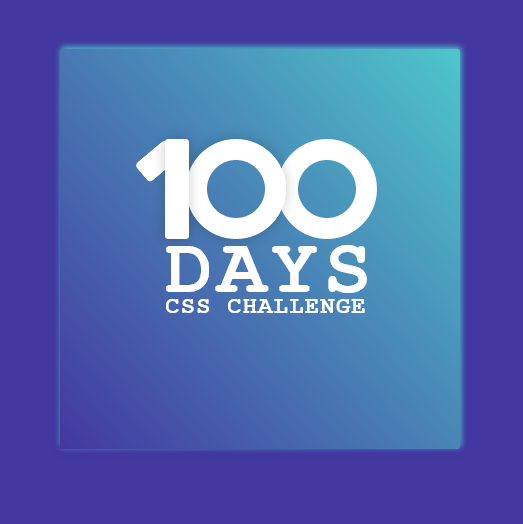

# 100 DAYS CSS CHALLENGE - DAY ONE

This is a solution to the [100 days css challenge](https://www.100dayscss.com). 100dayscss.com challenges help you improve your coding skills by building realistic projects. 

## Table of contents

- [Overview](#overview)
  - [The challenge](#the-challenge)
  - [Screenshot](#screenshot)
  - [Links](#links)
- [My process](#my-process)
  - [Built with](#built-with)
  - [What I learned](#what-i-learned)
  - [Continued development](#continued-development)
  - [Useful resources](#useful-resources)
- [Author](#author)
- [Acknowledgments](#acknowledgments)


## Overview

### The challenge

Users should be able to:

- See the size of the elements adjust based on their device's screen size
- `responsive design` 

### Screenshot



Add a screenshot of your solution.

### Links

- Github: [Add solution URL here](https://your-solution-url.com)
- Live Site URL: [Add live site URL here](https://your-live-site-url.com)

## My process

I like to write first the HTML, only the HTML, it looks weird but when it's
done I have a better idea of the styles needed.

Then I add CSS for everything (Neumorphism Design)

### Built with

- Semantic HTML5 markup
- CSS custom properties
- Flexbox
- position


### What I learned

1. How to Neumorphism design
2. How to use CSS position to position element on the webpage
3. learnt how to use css for lettering (to draw letters)


```html
<section class="wrapper">
        <div class="card">
            <div class="text-wrapper">
                <div class="one"></div>
                <div class="one-cross"></div>
                <div class="zero-1"></div>
                <div class="zero-2"></div>
                <div class="text">
                    <h3 class="day">
                        DAYS
                    </h3>
                    <small class="challenge">CSS CHALLENGE</small>
                </div>
            </div>
        </div>
    </section>
```
```css
  
.text-wrapper
.one{
    position: absolute;
    background: #fff;
    width: 24px;
    height: 100px;
    border-radius: 3px;
    z-index: 2;
    box-shadow: -.3px -0px 5px #cac;
}

.one-cross{
    position: absolute;
    background: #fff;
    width: 24px;
    height: 50px;
    top: 5.3rem;
    left: -1rem;
    border-radius: 5px;
    border-top-left-radius: 18px;
    border-top-right-radius: 4px;
    transform: rotate(50deg);
}
```

### Useful resources

## Author

- Github - [codeauthor1](https://www.github.com/codeauthor1)
- Codepen - [@Code  Author](https://www.codepen.io/codeauthor1/pen/VwQWBYv)
- Twitter - [@codeauthor_](https://www.twitter.com/codeauthor_)
- Instagram - [@codeauthor_](https://www.instagram.com/codeauthor_)
- Facebook - [@Code  Author](https://www.facebook.com/codeauthor1)


## Acknowledgments


